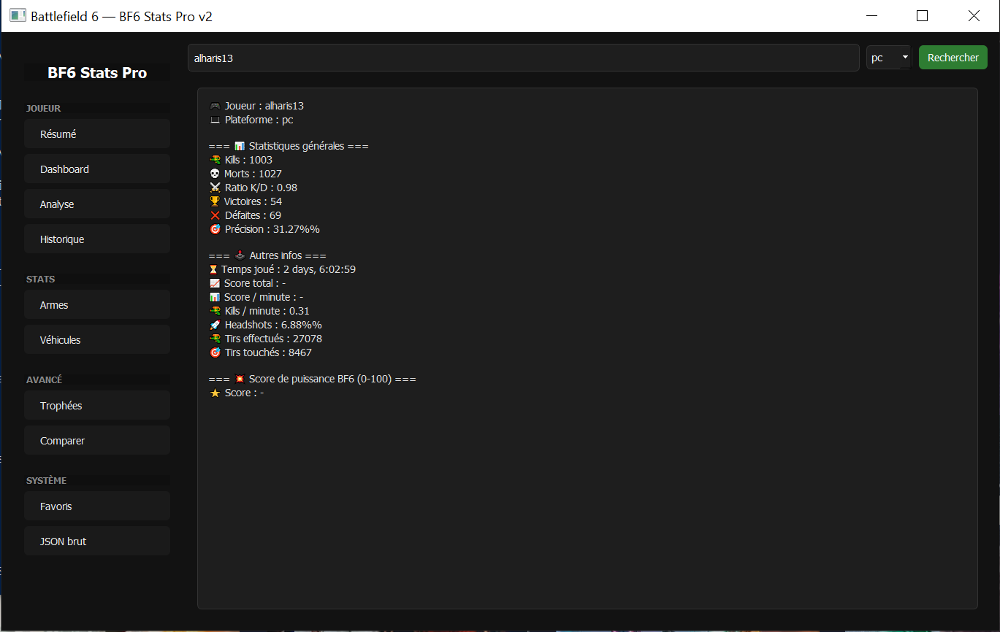
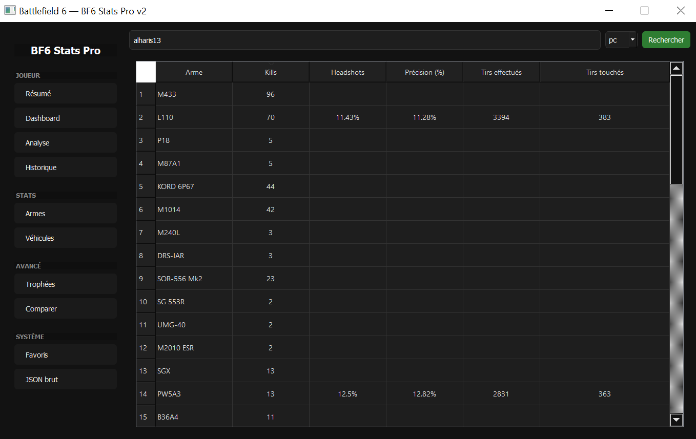
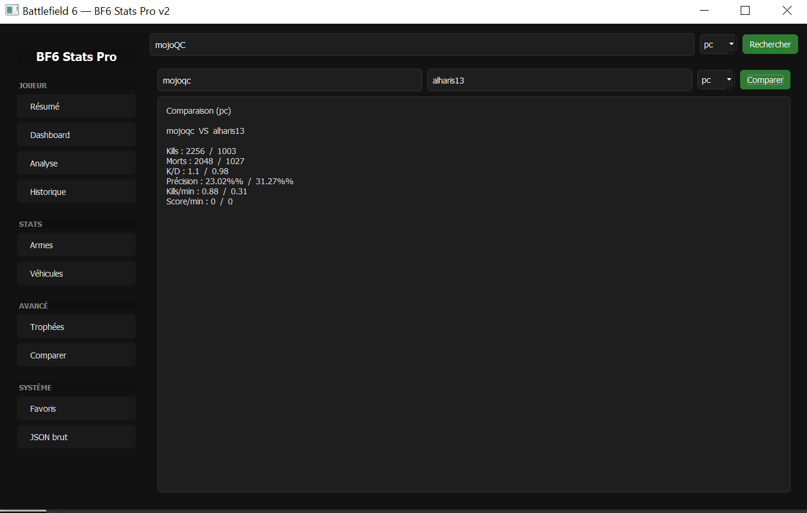
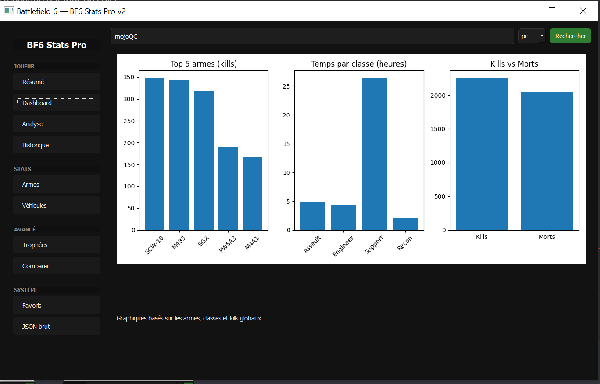

# 🔥 BF6 Stats Pro
Application desktop complète permettant de consulter, analyser et visualiser les statistiques Battlefield 6 via l’API GameTools.  
Développé en Python + PyQt5, avec interface moderne et fonctionnalités avancées.

---
Voici 4 captures d’écran de l’interface (images présentes à la racine) :

### 🖼️ Aperçu général
<p align="center">
  
</p>

### 📊 Dashboard & Graphiques
<p align="center">
  
</p>

### 🧠 Analyse avancée
<p align="center">
  
</p>

### 🛡️ Système de licence & Activation
<p align="center">
  
</p>
## ✨ Fonctionnalités principales

### 🧩 Interface moderne
- Thème sombre inspiré Battlefield
- Menu latéral animé
- Pages séparées (Résumé, Dashboard, Armes, Véhicules, Analyse, Trophées, Favoris, Comparateur…)

### 📊 Dashboard complet
- Graphiques interactifs (Matplotlib)
- Top armes
- Répartition des classes
- Kill vs Death charts

### 🧠 Analyse automatique
- Détection du style de jeu
- Conseils personnalisés
- Calcul du **BF6 Power Score** (0–100)

### 🎖️ Trophées & objectifs
- Système de badges basés sur les performances
- Suivi de progression

### 📝 Historique & Favoris
- Sauvegarde automatique des recherches
- Comparaison de joueurs
- Liste de favoris

### 🔐 Système de licence
- Activation à l’aide d’une clé unique
- Vérification en ligne via Pastebin (RAW)
- Stockage local sécurisé (`license.json`)
- Test licence BF6P-1A9D-7C3F-29E4
## 📸 Aperçu de l’application


---

## 📦 Installation

### 1️⃣ Installer Python 3.12+  
Installer depuis https://www.python.org/

### 2️⃣ Installer les dépendances
```bash
pip install -r requirements.txt
